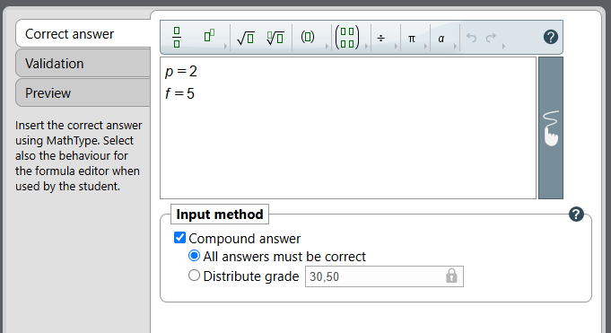
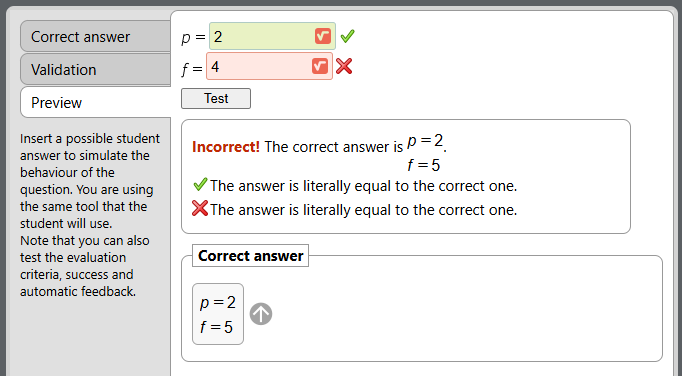
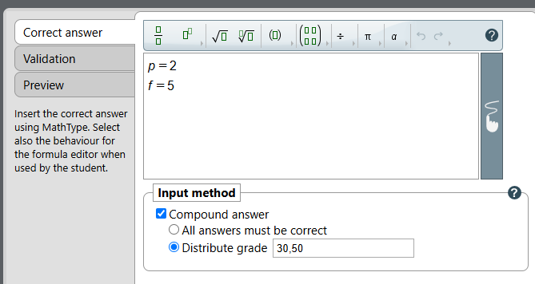
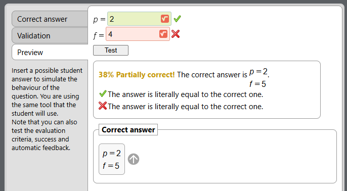

## Description

For General and Quantity inputs, you can ask student for more than one answer to a single question. 
To do so the "Compound answer" must be selected.

    NOTE: Although WIRIS supports both “All answers must be correct” and “Distribute grade” options the player 
    treats both as if the “All answers must be correct” option was selected.

<table border="1">
    <thead>
        <tr>
            <th>Option</th>
            <th>Description</th>
        </tr>
    </thead>
    <tbody>
        <tr>
            <td>All answers must be correct</td>
            <td>To get a score all answers must be correct.</td>
        </tr>
        <tr>
            <td>Distribute grade</td>
            <td>Score is obtained as a weighted sum of answers.
                  
                <b>Player treats this option the same as “All answers must be correct” option was selected.</b>
            </td>
        </tr>
    </tbody>
</table>

## All answers must be correct (example)

## Distribute grade (example)

## Related topics

<ol>
    <li><a href="../page/WIRIS-Allowed-input" title="Allowed input">Allowed input</a></li>
    <li><a href="../page/WIRIS-Comparison-with-student-answer" title="Comparison with student answer">Comparison with student answer</a></li>
    <li><a href="../page/WIRIS-Additional-properties" title="Additional Properties">Additional Properties</a></li>
</ol>
