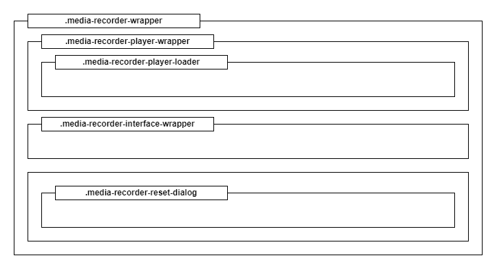
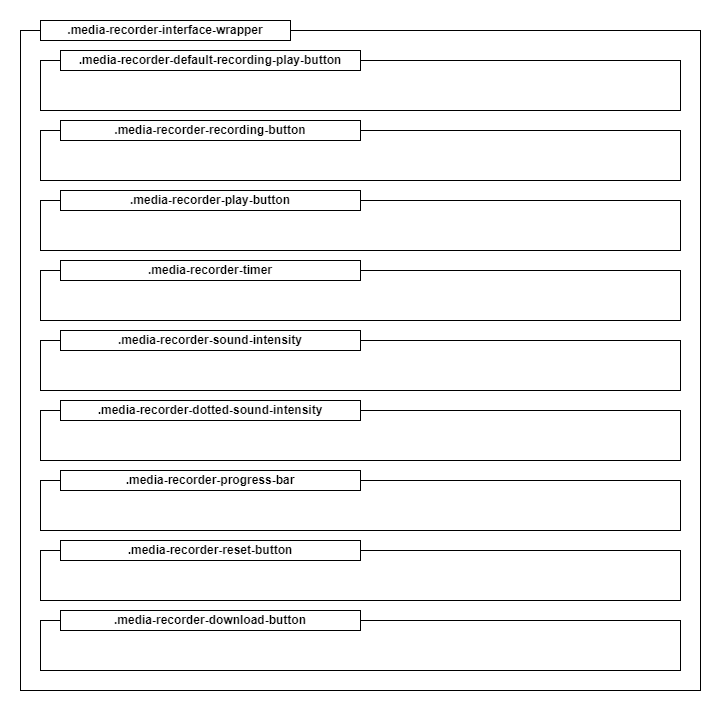
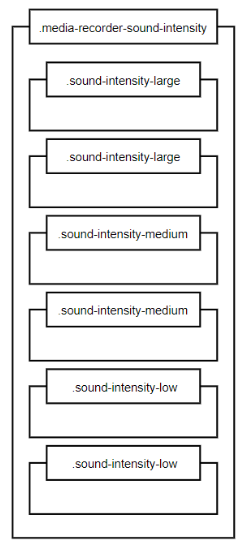
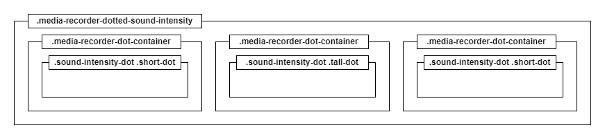
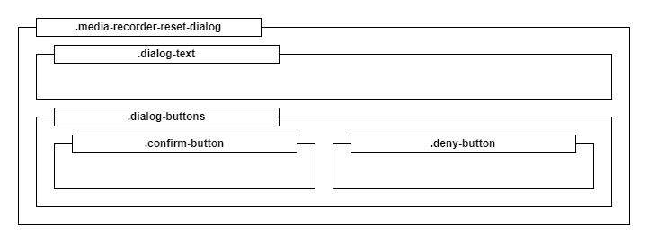

## Description

The Media Recorder addon allows you to record audio using your microphone. Then, you can also play your recording. 

***Note:***
*Be careful with the length of the recording. Long recordings can cause the lesson to be loading longer because each recording is stored in a lesson's state. You should limit the duration of the recording by setting the **Maximum recording duration** property.*

## Properties

The list starts with the common properties, learn more about them by visiting the [Modules description](https://www.mauthor.com/doc/en/page/Modules-description) section. The other available properties are described below.

<table border="1">
    <tr>
        <th>Property name</th>
        <th>Description</th>
    </tr>
    <tr>
        <td>Is disabled</td>
        <td>Allows disabling the module so that the user is not able to interact with it. Sets the style class for the entire addon to <b>.disabled</b>.</td>
    </tr>
    <tr>
        <td>Maximum recording duration</td>
        <td>The maximum recording time in seconds. You should limit this time so that the lesson's state is lighter. The value cannot exceed 1800 (equal to 30 minutes).</td>
    </tr>
    <tr>
        <td>Default recording</td>
        <td>The recording that will be loaded after starting the lesson. The recording should have <b>*.mp3</b> format. Works only when <b>Extended mode</b> is not selected.</td>
    </tr>
    <tr>
        <td>Recording start sound</td>
        <td>The sound effect that is played when you start recording. The sound effect should have <b>*.mp3</b> format.</td>
    </tr>
    <tr>
        <td>Recording stop sound</td>
        <td>The sound effect that is played when you stop recording. The sound effect should have <b>*.mp3</b> format.</td>
    </tr>
    <tr>
        <td>Show timer</td>
        <td>Shows the timer.</td>
    </tr>
    <tr>
        <td>Show default recording play button</td>
        <td>Shows the play button of the default recording. Works only when <b>Extended mode</b> is not selected.</td>
    </tr>
    <tr>
        <td>Reset removes recording</td>
        <td>Resets executed from <b>reset</b> command or external sources, such as <b>Reset Button</b> addon, also delete the user's recording.</td>
    </tr>
    <tr>
        <td>Enable in error checking mode</td>
        <td>When selected, the addon will be enabled in error checking mode.</td>
    </tr>
    <tr>
        <td>Extended mode</td>
        <td>In this mode after the recording is complete, it is possible only to play the recording, reset or download it. Only after resetting the recording, user can record again.</td>
    </tr>
    <tr>
        <td>Enable intensity change events</td>
        <td>When selected, the addon will send ValueChanged type events to Event Bus when audio intensity change. For more information, please check <b>Events</b> section.</td>
    </tr>
    <tr>
        <td>Reset dialog box</td>
        <td>Allows to set contents of the reset dialog box. This dialog will open after click on reset button provided in <b>Extended mode</b>. Check section <b>Reset dialog box</b> for more information. 
            <table border='1'>
                <tr>
                    <th>Property name</th>
                    <th>Description</th>
                </tr>
                <tr>
                    <td>Text</td>
                    <td>Content of dialog.</td>
                </tr>
                <tr>
                    <td>Yes</td>
                    <td>Content of button to confirm reset.</td>
                </tr>
                <tr>
                    <td>No</td>
                    <td>Content of button to cancel reset.</td>
                </tr>
            </table>
        </td>
    </tr>
    <tr>
        <td>Lang attribute</td>
        <td>This property allows defining the language for this addon (different than the language of the lesson).</td>
    </tr>
    <tr>
        <td>Speech texts</td>
        <td>Sets the values of speech texts - predefined phrases providing additional context while using the addon in the Text To Speech mode. Speech texts are always read using the content's default language.</td>
    </tr>
</table>

## Supported commands

<table border="1">
    <tr>
        <th>Command name</th>
        <th>Parameters</th>
        <th>Description</th>
    </tr>
    <tr>
        <td>startRecording</td>
        <td>-</td>
        <td>It starts recording when the addon has just been loaded or the recording has been loaded.</td>
    </tr>
    <tr>
        <td>stopRecording</td>
        <td>-</td>
        <td>It stops recording.</td>
    </tr>
    <tr>
        <td>startPlaying</td>
        <td>-</td>
        <td>It starts playback if there is a loaded recording.</td>
    </tr>
    <tr>
        <td>stopPlaying</td>
        <td>-</td>
        <td>It stops playback.</td>
    </tr>
    <tr>
        <td>setShowErrorsMode</td>
        <td>-</td>
        <td>It sets the show errors mode. All actions such as playback or recording are interrupted. Causes the addon to be inactive. Sets the style class for the entire addon to <b>.disabled</b></td>
    </tr>
    <tr>
        <td>setWorkMode</td>
        <td>-</td>
        <td>It sets the work mode. All functions are available again.</td>
    </tr>
    <tr>
        <td>enable</td>
        <td>-</td>
        <td>All actions are restored. Removes the <b>.disabled</b> style class for the entire addon.</td>
    </tr>
    <tr>
        <td>disable</td>
        <td>-</td>
        <td>All actions such as playback or recording are interrupted. Causes the addon to be inactive. Sets the style class for the entire addon to <b>.disabled</b></td>
    </tr>
    <tr>
        <td>show</td>
        <td>-</td>
        <td>Shows the addon.</td>
    </tr>
    <tr>
        <td>hide</td>
        <td>-</td>
        <td>Hides the addon.</td>
    </tr>
    <tr>
        <td>reset</td>
        <td>-</td>
        <td>Resets the addon. All actions, such as playback or recording are interrupted. The user's recording is deleted and the default recording, if defined, is loaded. This command does not reset in the same way as the reset button included after <b>Extended mode</b> is selected.</td>
    </tr>
</table>

## Advanced Connector integration

Each command supported by the Media Recorder addon can be used in the Advanced Connector addon scripts. The below example shows how to react on changes within the Text module gap content (ie. while putting in it elements from Source List) and change the displayed video accordingly.

    EVENTSTART
    Source:Text1
    Value:1
    SCRIPTSTART
        var mediaRecorder = presenter.playerController.getModule('Media_Recorder1');
        mediaRecorder.startRecording();
    SCRIPTEND
    EVENTEND

## Addon structure

The following sections describes CSS classes that make up the addon’s UI. 
These classes are organized into different groups based on their purpose: main structure, interface, sound intensity interfaces, and reset dialog box.
Understanding how these classes are organized and applied will help customize addon appearance, and integrate it seamlessly into your project.
Please note that in this addon all elements are created on the start, but not all UI elements are working even if some of CSS styles are them given.
Some UI elements will work after selecting the appropriate properties.

## Main structure

<table border="1">
    <tr>
        <th>Class name</th>
        <th>Description</th>
    </tr>
    <tr>
        <td>.media-recorder-wrapper</td>
        <td>The container of the whole addon.</td>
    </tr>
    <tr>
        <td>.disabled</td>
        <td>The style class that is added to the <b>.media-recorder-wrapper</b> when it is inactive.</td>
    </tr>
    <tr>
        <td>.media-recorder-wrapper-browser-not-supported</td>
        <td>The style class that is added to the <b>.media-recorder-wrapper</b> when a browser is not supported.</td>
    </tr>
    <tr>
        <td>.media-recorder-player-wrapper</td>
        <td>The player container that supports the recording. It may contain elements of the audio or video type. The audio element has a forced style that makes it invisible.</td>
    </tr>
    <tr>
        <td>.media-recorder-player-loader</td>
        <td>The container for the animation of loading the recording.</td>
    </tr>
    <tr>
        <td>.media-recorder-interface-wrapper</td>
        <td>The interface container including all interactive elements.</td>
    </tr>
    <tr>
        <td>.media-recorder-reset-dialog</td>
        <td>The reset dialog box. Can be opened with the reset button if <b>Extended mode</b> is selected.</td>
    </tr>
</table>

## Interface

<table border="1">
    <tr>
        <th>Class name</th>
        <th>Description</th>
    </tr>
    <tr>
        <td>.media-recorder-default-recording-play-button</td>
        <td>The container that performs the function of a two-state button for playing / stopping playing the default recording. This component is shown when <b>Extended mode</b> property is not selected and <b>Show default recording play button</b> property is selected.</td>
    </tr>
    <tr>
        <td>.media-recorder-recording-button</td>
        <td>The container that performs the function of a two-state button for recording / stopping recording.</td>
    </tr>
    <tr>
        <td>.media-recorder-play-button</td>
        <td>The container that performs the function of a two-state button for playing / stopping playing the user's recording.</td>
    </tr>
    <tr>
        <td>.media-recorder-timer</td>
        <td>The container of the recording time counter. The recording counter has the format: <b>mm:ss</b>, and while the playback: <b>mm:ss / mm:ss</b></td>
    </tr>
    <tr>
        <td>.media-recorder-sound-intensity</td>
        <td>The container showing the level of sound intensity when <b>Extended mode</b> property is not selected. Its components are shown in the <b>Sound intensity in default mode</b> section. The level of sound intensity is represented on a 6-level scale.</td>
    </tr>
    <tr>
        <td>.media-recorder-dotted-sound-intensity</td>
        <td>The container showing the level of sound intensity when <b>Extended mode</b> property is selected. Its components are shown in the <b>Sound intensity in extended mode</b> section. The level of sound intensity is represented by height of dots.</td>
    </tr>
    <tr>
        <td>.media-recorder-progress-bar</td>
        <td>The container of the progress bar of user's recording. Component works only when <b>Extended mode</b> is selected and user's recording is done.</td>
    </tr>
    <tr>
        <td>.media-recorder-reset-button</td>
        <td>The container of the reset button. Opens reset dialog box. Component works only when <b>Extended mode</b> is selected.</td>
    </tr>
    <tr>
        <td>.media-recorder-download-button</td>
        <td>The container of the download button. Component works only when <b>Extended mode</b> is selected and user's recording is done.</td>
    </tr>
</table>

## Sound intensity in default mode

Representation of sound intensity when `Extended mode` property is not selected is done by element with CSS class `.media-recorder-sound-intensity`.

<table border="1">
    <tr>
        <th>Class name</th>
        <th>Description</th>
    </tr>
    <tr>
        <td>.sound-intensity-large</td>
        <td>The style of the two large sound levels when the level is inactive.</td>
    </tr>
    <tr>
        <td>.sound-intensity-medium</td>
        <td>The style of the two medium sound levels when the level is inactive.</td>
    </tr>
    <tr>
        <td>.sound-intensity-low</td>
        <td>The style of the two low sound levels when the level is inactive.</td>
    </tr>
    <tr>
        <td>.selected</td>
        <td>The style class that is added to active sound levels.</td>
    </tr>
</table>

## Sound intensity in extended mode

Representation of sound intensity when `Extended mode` property is selected is done by element with CSS class `.media-recorder-dotted-sound-intensity`.  

<table border="1">
    <tr>
        <th>Class name</th>
        <th>Description</th>
    </tr>
    <tr>
        <td>.media-recorder-dot-container</td>
        <td>The style class of container with dot. There are three dots.</td>
    </tr>
    <tr>
        <td>.sound-intensity-dot</td>
        <td>The style class of dot. A change in the height of these dots represents a change in the intensity of the sound.</td>
    </tr>
    <tr>
        <td>.short-dot</td>
        <td>The style class that is added to the left and right dots.</td>
    </tr>
    <tr>
        <td>.tall-dot</td>
        <td>The style class that is added to the middle dot.</td>
    </tr>
</table>

## Reset dialog box

Can be opened with the reset button if `Extended mode` is selected.

<table border="1">
    <tr>
        <th>Class name</th>
        <th>Description</th>
    </tr>
    <tr>
        <td>.dialog-text</td>
        <td>The style class of container with message. Default message can be changed in <b>Reset dialog box</b> -> <b>Text</b> property.</td>
    </tr>
    <tr>
        <td>.dialog-buttons</td>
        <td>The style class of container with buttons.</td>
    </tr>
    <tr>
        <td>.confirm-button</td>
        <td>The style class of confirm button. Default message can be changed in <b>Reset dialog box</b> -> <b>Yes</b> property.</td>
    </tr>
    <tr>
        <td>.deny-button</td>
        <td>The style class of deny button. Default message can be changed in <b>Reset dialog box</b> -> <b>No</b> property.</td>
    </tr>
</table>

## Events

<table border="1">
    <tr>
        <th>Event name</th>
        <th>Field name</th>
        <th>Description</th>
    </tr>
    <tr>
        <td rowspan="3">ValueChanged</td>
        <td>source</td>
        <td>The sender's ID</td>
    </tr>
    <tr>
        <td>item</td>
        <td>Possible values: 
            <li>recorder – for recording actions</li>
            <li>player – for playing a user recording </li>
            <li>default – for playing a default recording</li>
            <li>intensity – for change in intensity. To unlock event please select <b>Enable intensity change events</b> property.</li>
        </td>
    </tr>
    <tr>
        <td>value</td>
        <td>Possible values: 
            <li>start – for starting recording / playing</li>
            <li>stop – for stopping recording / playing</li>
            <li>value between 0 and 6 – for change in intensity</li>
        </td>
    </tr>
</table>

## Default styles

    .media-recorder-wrapper {
        position: absolute;
        width: auto;
        height: auto;
        display: block;
    }
    
    .media-recorder-wrapper .media-recorder-player-wrapper {
        position: relative;
        width: auto;
        height: auto;
    }
    
    .media-recorder-wrapper .media-recorder-interface-wrapper {
        width: 300px;
        height: 40px;
        display: flex;
        align-items: center;
        background-color: #EBEFF0;
        border-radius: 20px;
        padding-left: 10px;
        -webkit-border-radius: 20px;
        -moz-border-radius: 20px;
    }
    
    .media-recorder-wrapper .media-recorder-recording-button {
        width: 25px;
        height: 25px;
        margin: 0px 3px;
        background: url('resources/003-record-button.svg') no-repeat center;
        background-size: 100%;
    }
    
    .media-recorder-wrapper .media-recorder-recording-button.selected {
        background: black url('resources/004-stop-button.svg') no-repeat center;
        border-radius: 50%;
        background-size: 100%;
    }
    
    .media-recorder-wrapper .media-recorder-play-button {
        width: 25px;
        height: 25px;
        margin: 0px 3px;
        background: url('resources/001-play-button.svg') no-repeat center;
        background-size: 100%;
    }
    
    .media-recorder-wrapper .media-recorder-play-button.selected {
        background: black url('resources/004-stop-button.svg') no-repeat center;
        background-size: 100%;
        border-radius: 50%;
    }
    
    .media-recorder-wrapper .media-recorder-default-recording-play-button {
        width: 25px;
        height: 25px;
        margin: 0px 3px;
        background: url('resources/002-play-default-recording-button.svg') no-repeat center;
        background-size: 100%;
    }
    
    .media-recorder-wrapper .media-recorder-default-recording-play-button.selected {
        background: black url('resources/004-stop-button.svg') no-repeat center;
        background-size: 100%;
        border-radius: 50%;
    }
    
    .media-recorder-wrapper .media-recorder-timer {
        width: 100px;
        height: 30px;
        line-height: 30px;
        margin: 0px 10px;
        text-align: center;
        font-size: 14px;
        color: grey;
        font-family: Arial, "Helvetica Neue", Helvetica, sans-serif;
    }
    
    .media-recorder-wrapper.extended-mode .media-recorder-timer {
        width: auto;
    }
    
    .media-recorder-wrapper .media-recorder-sound-intensity {
        width: 20px;
        margin: 0px 10px;
        display: flex;
        flex-direction: column;
    }
    
    .media-recorder-wrapper .media-recorder-dotted-sound-intensity {
        width: 25px;
        height: 25px;
        margin: 0px 10px;
        display: flex;
        flex-direction: row;
    }
    
    .media-recorder-wrapper .media-recorder-dot-container {
        height: 100%;
        position: relative;
        width: 8px;
    }
    
    .media-recorder-wrapper .sound-intensity-dot {
        width: 6px;
        height: 6px;
        border-radius: 6px;
        display: block;
        background-color: #1870b7;
        margin: 0;
        position: absolute;
        top: 50%;
        -ms-transform: translateY(-50%);
        transform: translateY(-50%);
    }
    
    .media-recorder-wrapper .center {
        margin: 0;
        position: absolute;
        top: 50%;
        -ms-transform: translateY(-50%);
        transform: translateY(-50%);
      }
    
    .media-recorder-wrapper .sound-intensity-large:first-child {
        border-top: 1px solid;
    }
    
    .media-recorder-wrapper .sound-intensity-large {
        width: 100%;
        height: 3px;
        border-bottom: 1px solid;
        background-color: #990000;
        margin: auto;
    }
    
    .media-recorder-wrapper .sound-intensity-large.selected {
        background-color: #FF0000;
    }
    
    .media-recorder-wrapper .sound-intensity-medium {
        width: 100%;
        height: 3px;
        border-bottom: 1px solid;
        background-color: #999900;
        margin: auto;
    }
    
    .media-recorder-wrapper .sound-intensity-medium.selected {
        background-color: #E4E400;
    }
    
    .media-recorder-wrapper .sound-intensity-low {
        width: 100%;
        height: 3px;
        border-bottom: 1px solid;
        background-color: #4C9900;
        margin: auto;
    }
    
    .media-recorder-wrapper .sound-intensity-low.selected {
        background-color: #71E200;
    }
    
    .media-recorder-wrapper .media-recorder-player-loader {
    }
    
    .media-recorder-wrapper .video-loader {
        border: 5px solid #f3f3f3;
        border-top: 5px solid #1d2830;
        border-radius: 50%;
        animation: spin 0.7s linear infinite;
        position: absolute;
        margin: auto;
        left: 0;
        right: 0;
        top: 0;
        bottom: 0;
    }
    
    .media-recorder-wrapper.disabled {
        opacity: 0.5;
    }
    
    .media-recorder-wrapper .media-recorder-reset-button {
        width: 25px;
        height: 25px;
        margin: 0px 3px;
        background-size: 100%;
        background: url('resources/005-reset-button.svg') no-repeat center;
        display: none;
    }
    
    .media-recorder-wrapper .media-recorder-download-button {
        width: 25px;
        height: 25px;
        margin: 0px 3px;
        background-size: 100%;
        background: url('resources/006-download-button.svg') no-repeat center;
        display: none;
    }
    
    .media-recorder-wrapper .media-recorder-progress-bar {
        width: 80px;
        height: 10px;
        margin: 1px 1px;
        display: none;
        background-color: white;
        border-radius: 5px;
        position: relative;
    }
    
    .media-recorder-wrapper .media-recorder-progress-bar-slider {
        width: 10px;
        height: 10px;
        display: block;
        background-color: black;
        border-radius: 5px;
        position: absolute;
        cursor: pointer;
    }
    
    .media-recorder-wrapper .media-recorder-progress-bar-wrapper {
        width: 80px;
        height: 25px;
        margin: 0px 3px;
        display: none
    }
    
    .media-recorder-wrapper .media-recorder-reset-dialog {
        display: none;
        width:300px;
        padding: 10px 10px 15px;
        position:absolute;
        top:-90px;
        background-color: white;
        box-shadow: 8px 8px 5px rgb(0 0 0 / 40%);
        z-index: 99999;
    }
    
    .media-recorder-wrapper .media-recorder-reset-dialog .dialog-text {
        text-align: center;
        padding: 5px 5px 10px;
    }
    
    .media-recorder-wrapper .media-recorder-reset-dialog .dialog-buttons {
        display: flex;
    }
    
    .media-recorder-wrapper .media-recorder-reset-dialog .deny-button {
        margin: auto;
        text-align: center;
        background-color: red;
        color: white;
        padding: 3px 15px;
        display: block;
        cursor: pointer;
    }
    
    .media-recorder-wrapper .media-recorder-reset-dialog .confirm-button {
        margin: auto;
        text-align: center;
        background-color: green;
        color: white;
        padding: 3px 15px;
        display: block;
        cursor: pointer;
    }
    
    .disable-record-button {
        pointer-events: none;
        cursor: default;
        opacity: 0.5;
    }
    
    @keyframes spin {
        0% {
            transform: rotate(0deg);
        }
        100% {
            transform: rotate(360deg);
        }
    }
 